# Virtual Table (vtable)

- C++ standard doesn't force any particular way the virtual functions should be implemented.

- However, c++ compilers like MSVC, Clang or GCC implement the virtual functions using the `virtual method table`.
  
- when a class implements `virtual function`, the compiler is going to create `Virtual Table`. this table is a simple array which contains addresses of the virtual functions that the class implements or derives.

### 1. VTABLE 
- only virtual methods addresses are added into vtable.  

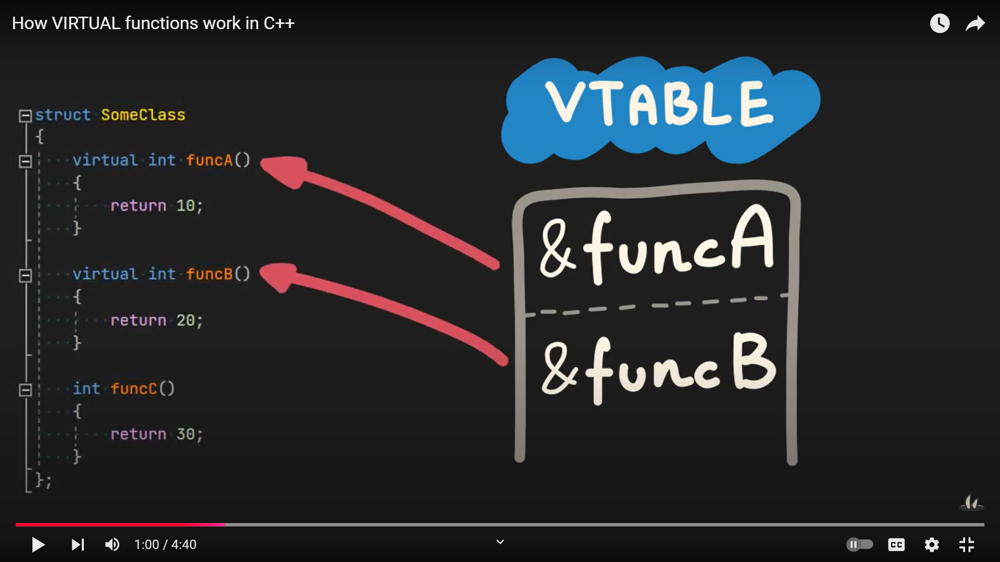 

### 2. Memory Layout
- when class has virtual function it will create a hidden member vtable pointer and it will located at beginning in memory layout.
  
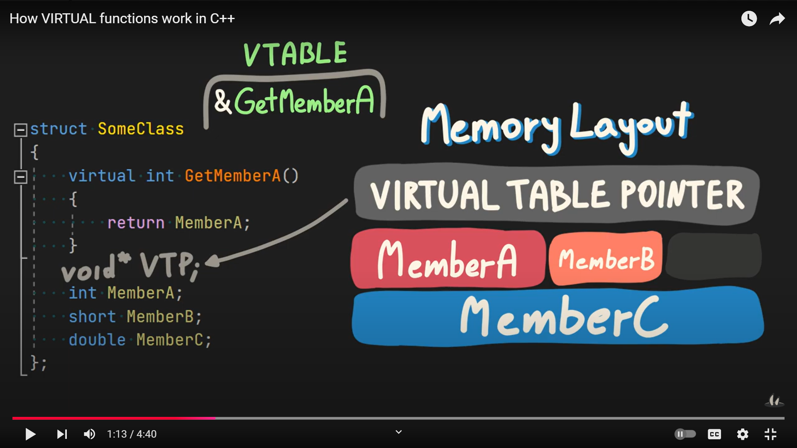 

### 3. Derive from Class
- one class derives from the other class which already has a virtual table.
  
- compiler copy the content of base class vtable. 
  
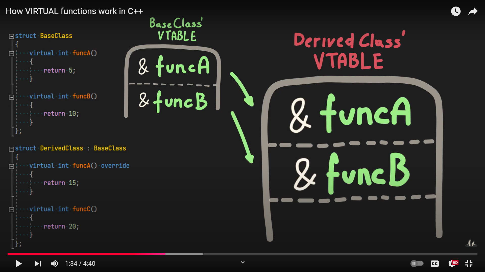 

- then replace overridden function from derived class.
  
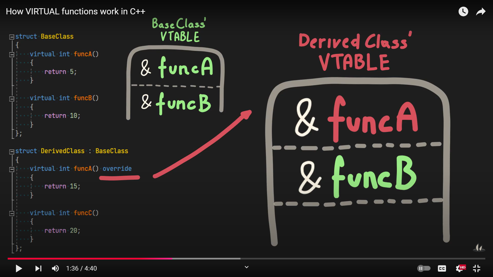

- if derived class implements additional virtual functions, they are going to be placed at the end of the current virtual table.
  
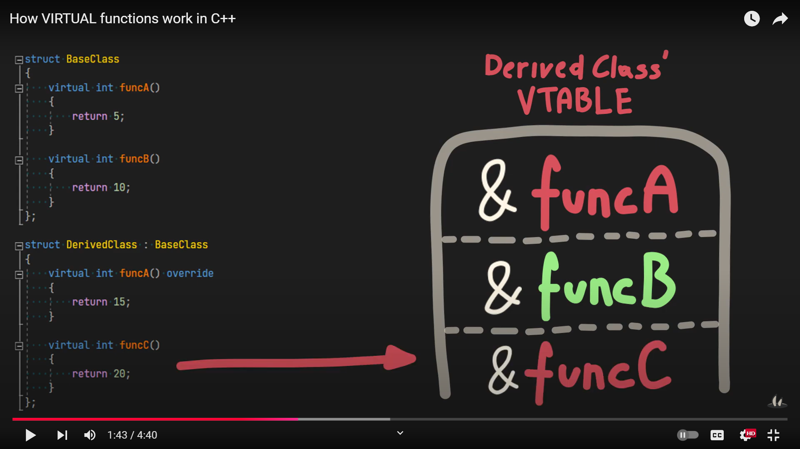 

### 4. More than one Virtual Table
- this happens we derive from two different base classes which already have at least one virtual table.
- Depending on the inheritance order the first one going to be related to BaseClassA and second one to BaseClassB.
- both base class vtable contents copied to derived class.
  
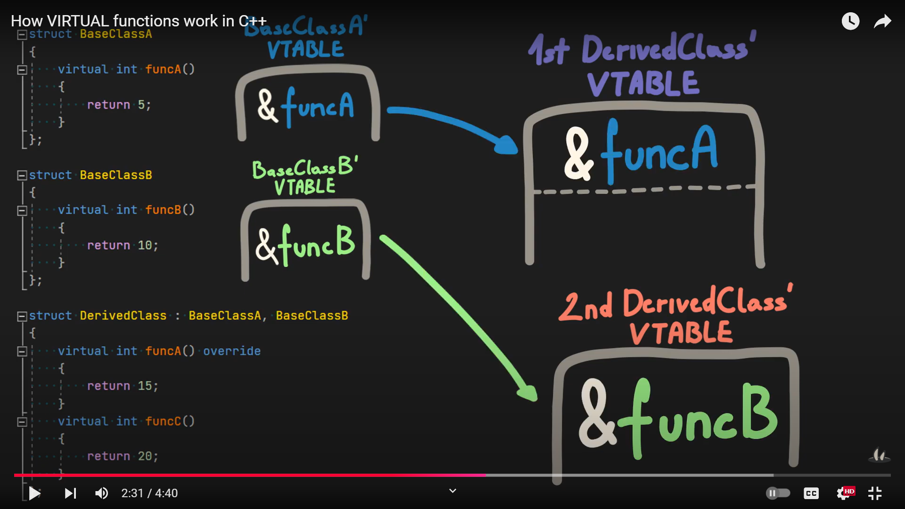 

- then replaced with overridden function addresses.
   
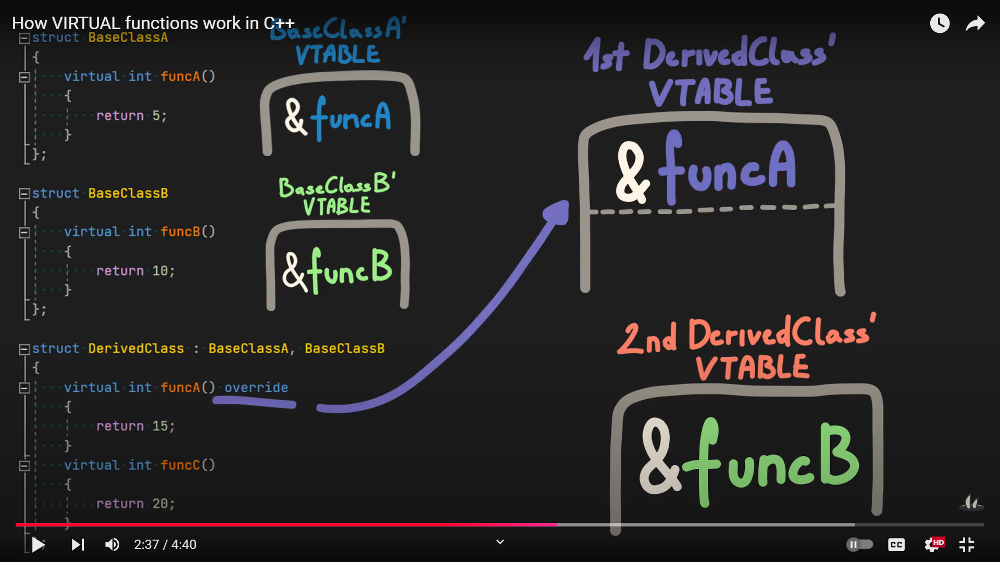 

- new virtual functions are going to be merged with first virtual table.
  
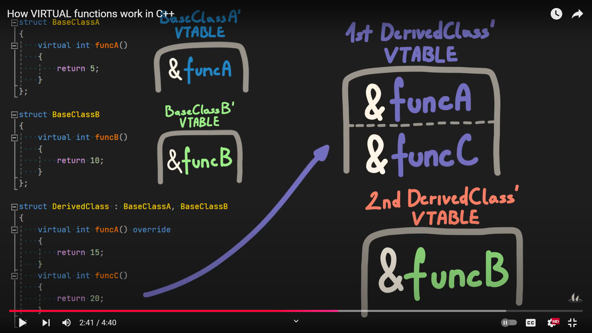 

### 5. Memory Layout for >1 VTable  
- corresponding virtual table are going to be placed at the beginning of each base class object inside derived class memory layout.

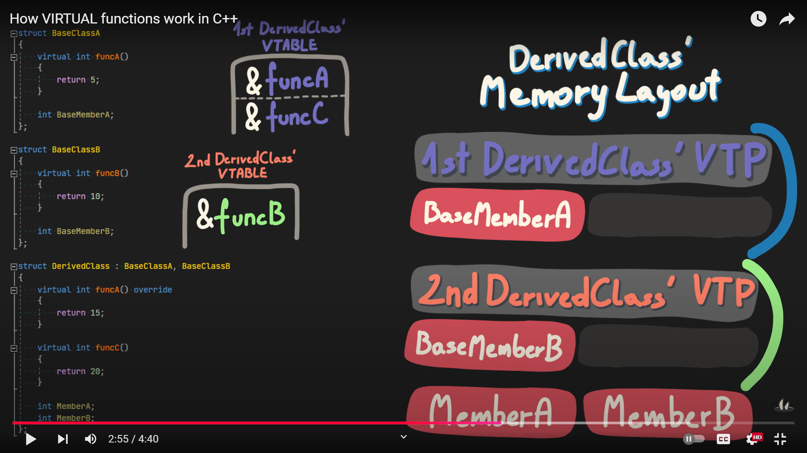 

## 6. While Execution
- while execute the virtual function using a pointer, dynamic dispatch is used.
- first we are going to check virtual table pointer which locates virtual table
- then we get the address from the virtual address from vtable which we can use to call the function.
  
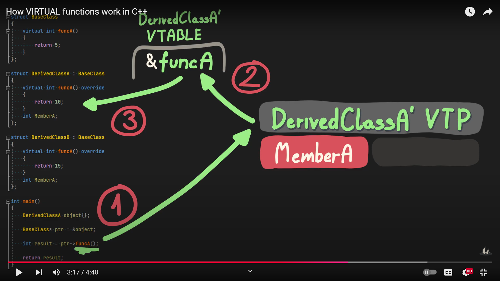 

- depending on the class the object created from, the virtual table is going to differ and different function might be executed.
  
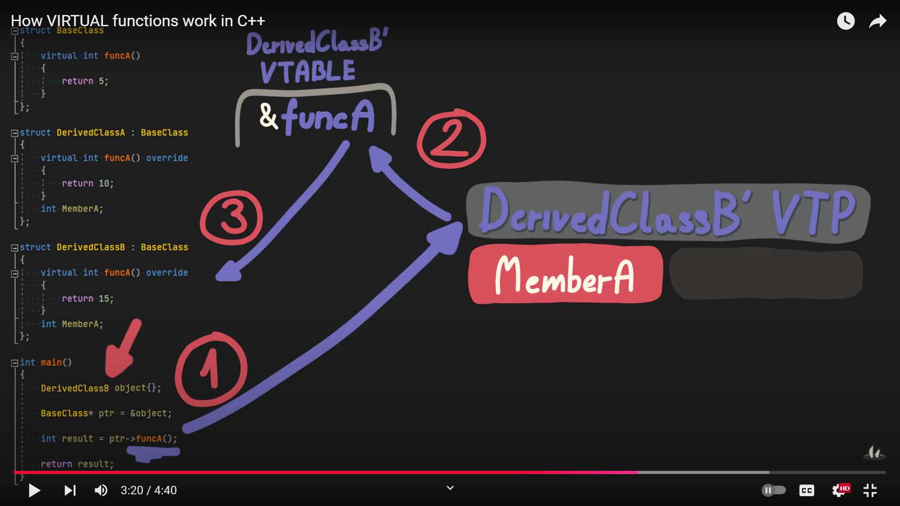 

## 7. Virtual Table Pointer Setup
- The constructor is responsible for filling this pointer before user defined logic is executed.
  
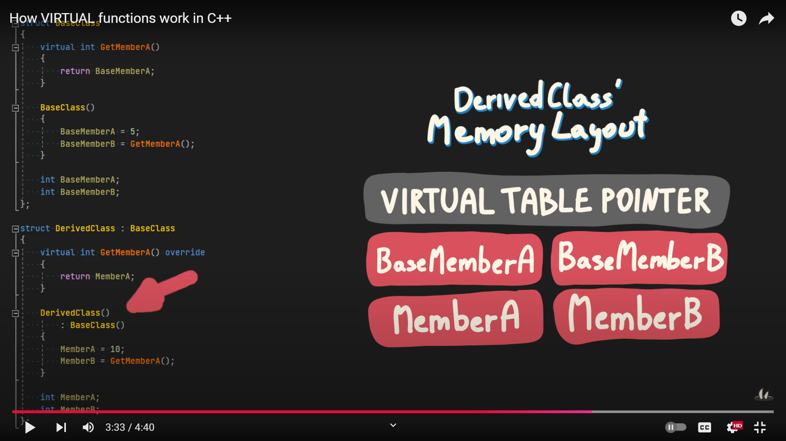 

- if there is a base class like in this example, its constructor will first setup BaseClass virtual table 
  
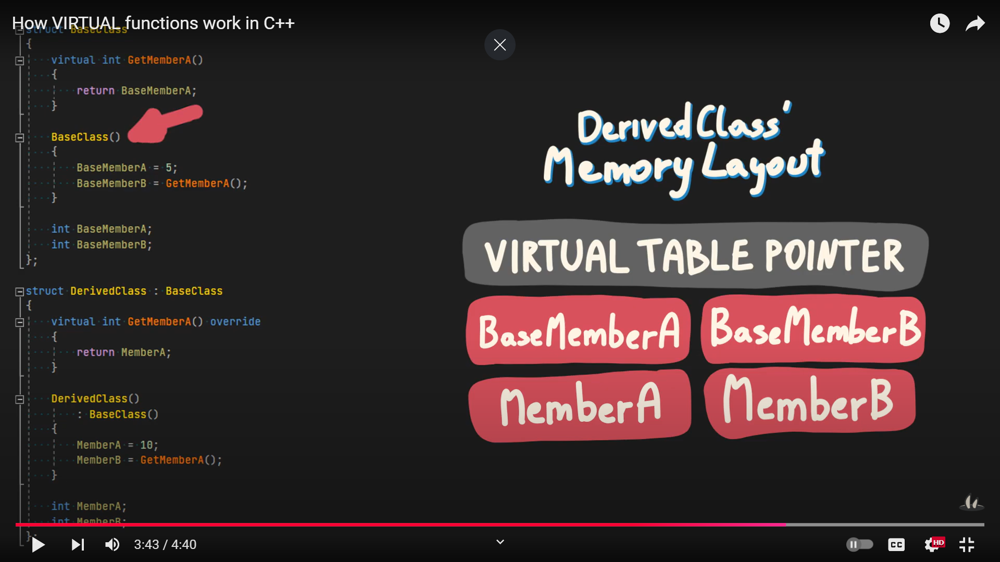 

- then user defined constructor for the BaseClass can proceed.
  
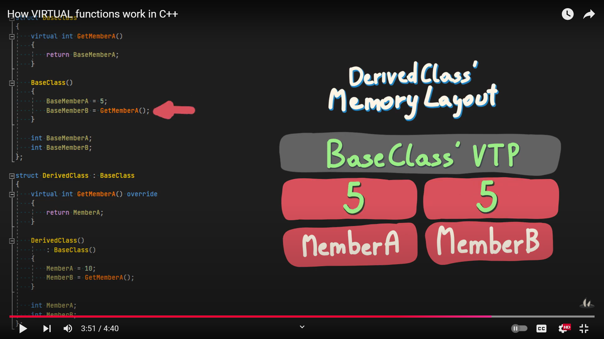 

- After base class constructor finishes, the derivedClass virtual table is filled in and user defined logic can now be executed.
  
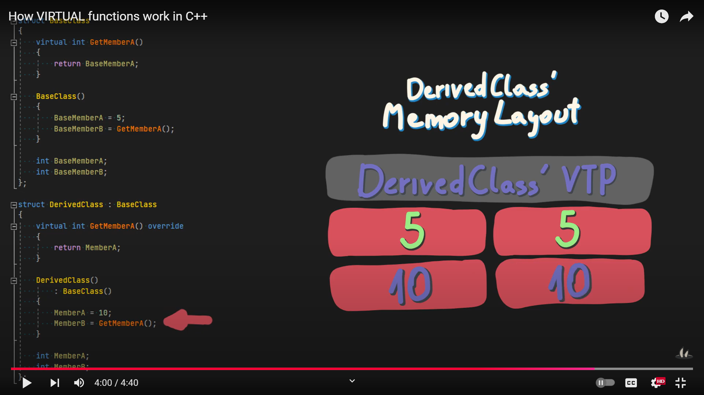 

- Note: Eventhough GetMemberA is overridden by DerivedClass, inside BaseClass constructor, 

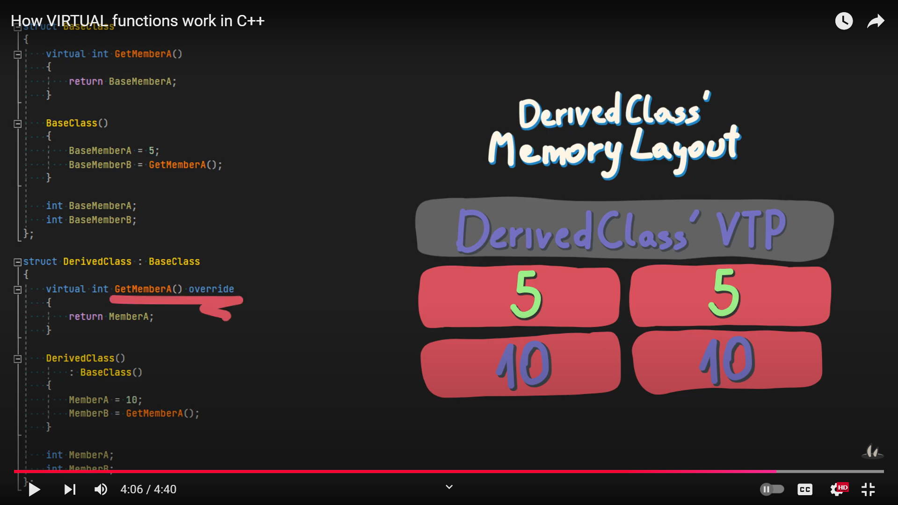

- the original function is going to be used.
  
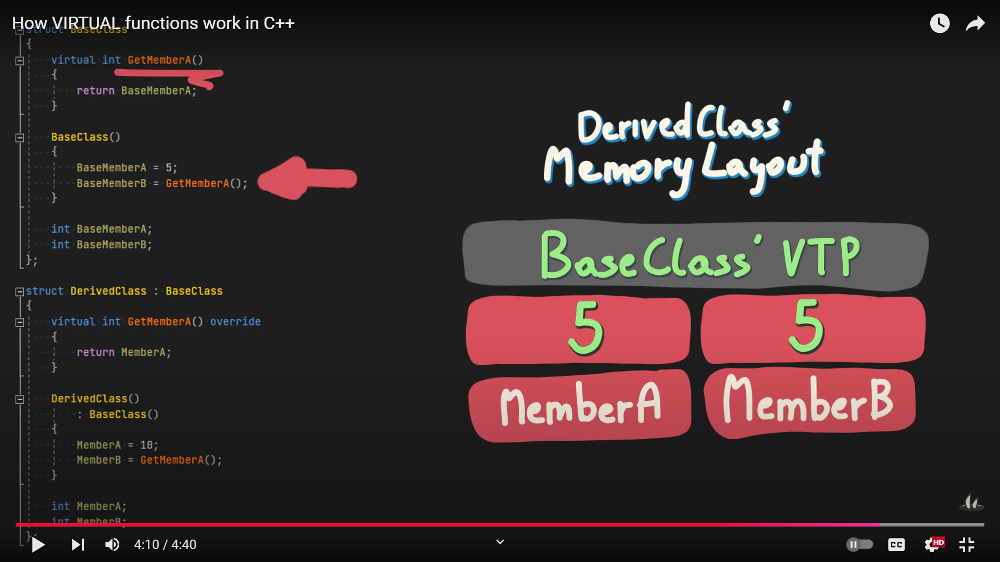 

- This is to prevent a situation where overridden function inside the constructor will try to access data that hasn't been initialized yet.
  
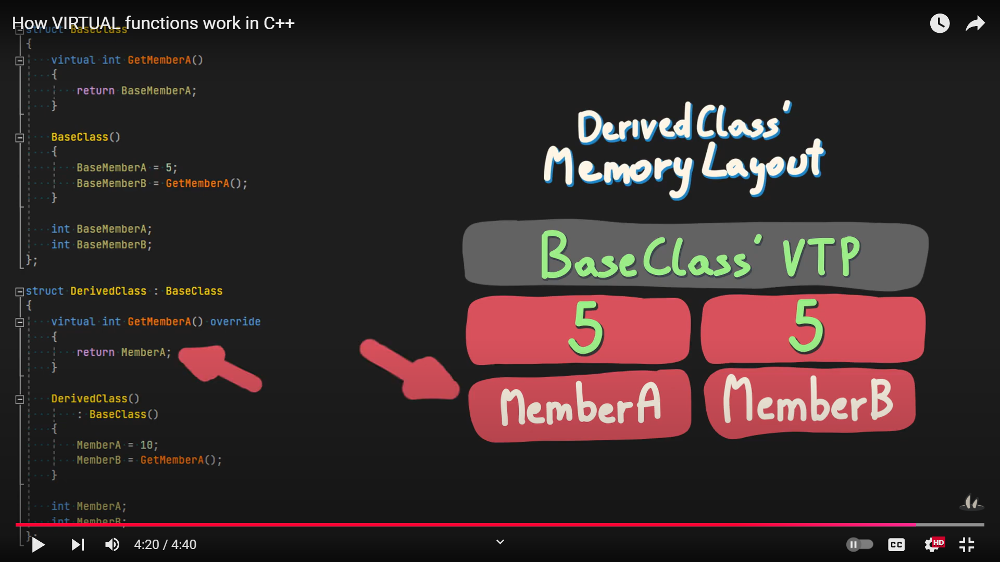 